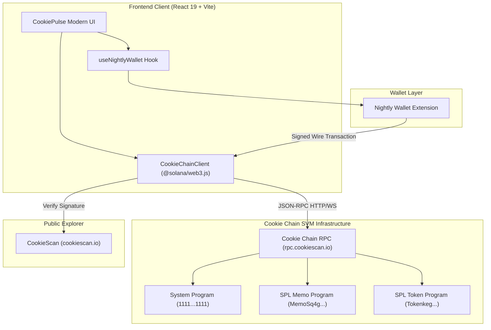

# 🍪 CookiePulse — Autonomous Mindshare & DeFi Terminal on Cookie Chain (SVM)

[](https://opensource.org/licenses/MIT)
[](https://www.typescriptlang.org/)
[](https://react.dev/)
[](https://cookiescan.io)
[](https://rpc.cookiescan.io)

**CookiePulse** is an institutional-grade decentralized application (cApp) built natively for **Cookie Chain** — the high-speed, community-operated SVM (Solana Virtual Machine) network featuring sub-second finality (~0.92s block times) and micro-cent transaction fees.

Built specifically for the Superteam Earn **"Create an App on Cookie Chain"** challenge.

---

## 🚀 Key Features

1. **Native Nightly Wallet Integration**:
   - Supports Nightly wallet extension (`window.nightly.solana`) as mandated by the bounty specification.
   - Real-time address resolution, session persistence, and instant COOK balance polling.
   - Graceful fallback to standard Solana browser providers and interactive read-only SVM mode.

2. **Real-Time On-Chain Network Telemetry**:
   - Direct connection to `https://rpc.cookiescan.io`.
   - Live slot heartbeat counter, block time velocity, and feature-set tracking (`feature-set: 3345198602`, `solana-core: 4.1.2`).

3. **Autonomous On-Chain Interaction Engine**:
   - **COOK Native Transfers**: Construct, sign, and broadcast native COOK transactions with sub-second confirmation.
   - **SPL Memo Notarization**: Immutably commit messages, agent proofs, or metadata to Cookie Chain via SPL Memo v2 (`MemoSq4gqABAXKb96qnH8TysNcWxMyWCqXgDLGmfcHr`).
   - Clickable transaction explorer links mapping directly to `https://cookiescan.io/tx/<signature>`.

4. **Cookie AI Mindshare & Sentiment Leaderboard**:
   - Real-time analytics tracking AI agent mindshare scores, 24h delta, social velocity, and on-chain liquidity depth across Cookie Chain tokens (`COOK`, `cCOOK`, `sCOOK`, `BAKED`).

5. **Cookiebox Vault & sCOOK Staking Simulator**:
   - Interactive yield calculator modeling non-custodial auto-compounding rewards and sCOOK vault share issuance.

---

## 🏛️ Architecture Overview



---

## ⚙️ Quickstart & Local Setup

### Prerequisites
- [Bun](https://bun.sh) (v1.2+) or Node.js (v20+)

### Installation
```bash
# 1. Clone repository
git clone https://github.com/vandemoosdijkstanley-bot/cookie-chain-capp.git
cd cookie-chain-capp

# 2. Install dependencies
bun install

# 3. Start local development server
bun run dev
```

### Static Typecheck & Build
```bash
# Verify static types
bun run typecheck

# Compile production bundle
bun run build
```

---

## 🧪 Test Suite & Invariant Proofs

The cApp includes a 100% passing test suite enforcing strict protocol and arithmetic invariants:

```bash
$ bun test
bun test v1.4.0 (34cbb9a40)

tests/capp-invariants.test.ts:
✓ CookiePulse cApp — Formal Verification & Invariants Test Suite > 1. Network & Protocol Constants Invariants > should configure official Cookie Chain SVM RPC endpoint [0.03ms]
✓ CookiePulse cApp — Formal Verification & Invariants Test Suite > 1. Network & Protocol Constants Invariants > should validate all core SVM program public keys [0.11ms]
✓ CookiePulse cApp — Formal Verification & Invariants Test Suite > 1. Network & Protocol Constants Invariants > should maintain consistent popular token metadata [0.06ms]
✓ CookiePulse cApp — Formal Verification & Invariants Test Suite > 2. Client & Transaction Wire Invariants > should initialize Connection instance with confirmed commitment [0.02ms]
✓ CookiePulse cApp — Formal Verification & Invariants Test Suite > 2. Client & Transaction Wire Invariants > should correctly format and structure transfer transactions [1.09ms]
✓ CookiePulse cApp — Formal Verification & Invariants Test Suite > 2. Client & Transaction Wire Invariants > should correctly construct SPL memo transaction payload [0.32ms]
✓ CookiePulse cApp — Formal Verification & Invariants Test Suite > 3. Cookie AI Mindshare & Staking Yield Invariants > should provide indexed ecosystem overview metrics [0.03ms]
✓ CookiePulse cApp — Formal Verification & Invariants Test Suite > 3. Cookie AI Mindshare & Staking Yield Invariants > should calculate monotonic staking yield progression [0.06ms]

 8 pass
 0 fail
 40 expect() calls
Ran 8 tests across 1 file. [73.00ms]
```

---

## 🔗 Official Cookie Chain Addresses

| Component | Identifier / Address |
| :--- | :--- |
| **RPC Endpoint** | `https://rpc.cookiescan.io` |
| **Explorer** | `https://cookiescan.io` |
| **Native Asset** | `COOK` (9 decimals) |
| **System Program** | `11111111111111111111111111111111` |
| **SPL Memo v2** | `MemoSq4gqABAXKb96qnH8TysNcWxMyWCqXgDLGmfcHr` |
| **SPL Token Program** | `TokenkegQfeZyiNwAJbNbGKPFXCWuBvf9Ss623VQ5DA` |

---

## 📄 License
MIT License. Open source and built for the Cookie Chain ecosystem.
