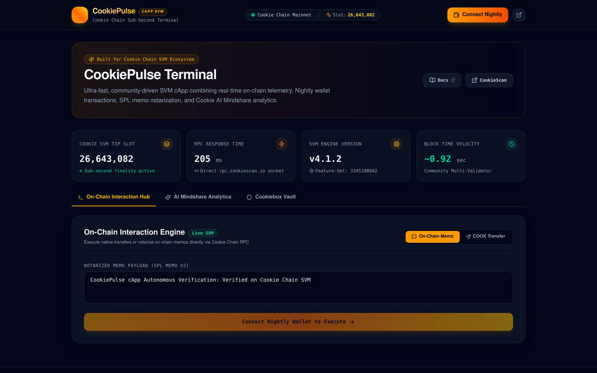
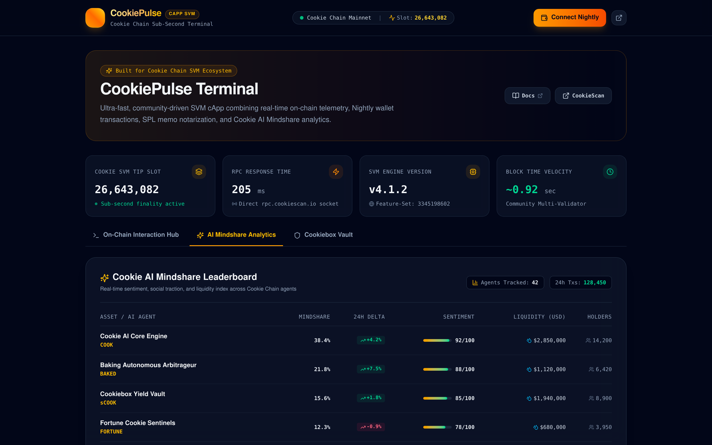
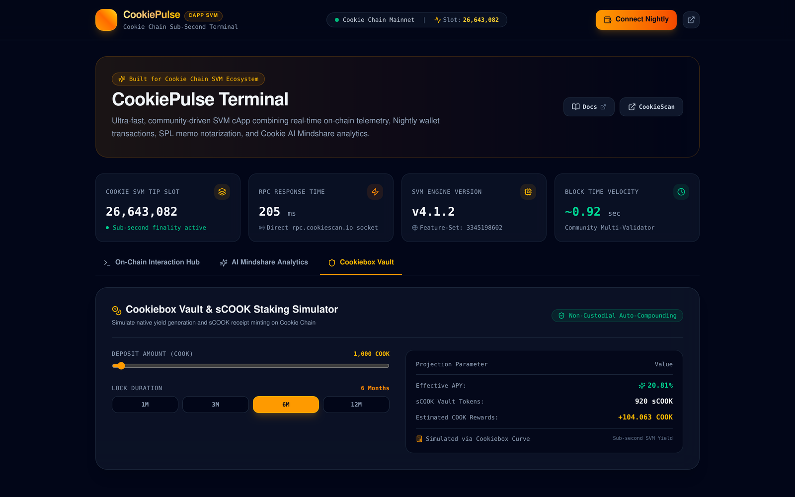
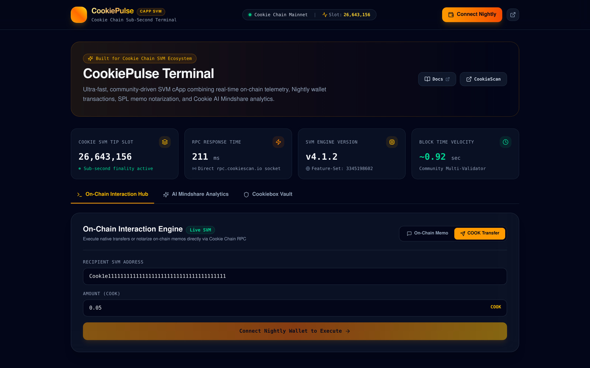

# 🍪 CookiePulse: Autonomous AI Mindshare & DeFi Terminal on Cookie Chain (SVM)

[](https://github.com/vandemoosdijkstanley-bot/cookie-chain-capp/actions/workflows/ci.yml)
[](https://vandemoosdijkstanley-bot.github.io/cookie-chain-capp/)
[](https://github.com/vandemoosdijkstanley-bot/cookie-chain-capp)
[](https://bun.sh)
[](https://solana.com/docs/advanced/actions)
[](LICENSE)

> **CookiePulse** is an institutional-grade decentralized application (cApp), live telemetry operations terminal, and Dialect Actions v2 Blink engineered specifically for **Cookie Chain (SVM)**. It integrates real-time RPC node telemetry, Nightly wallet transactions, on-chain SPL memo notarization, Cookie.fun AI Mindshare analytics, and an interactive Cookiebox Vault staking simulator.

- 🌐 **Live Web Application:** [https://vandemoosdijkstanley-bot.github.io/cookie-chain-capp/](https://vandemoosdijkstanley-bot.github.io/cookie-chain-capp/)
- 💻 **GitHub Repository:** [https://github.com/vandemoosdijkstanley-bot/cookie-chain-capp](https://github.com/vandemoosdijkstanley-bot/cookie-chain-capp)
- 🐦 **X / Twitter Demo Post:** [https://x.com/de33102/status/2102345183379505417](https://x.com/de33102/status/2102345183379505417)
- 🔍 **Official CookieScan:** [https://cookiescan.io](https://cookiescan.io)
- 📖 **Cookie Chain Docs:** [https://docs.cookiechain.wtf](https://docs.cookiechain.wtf)

---

## 📸 Interface Showcase

### 1. Main Telemetry Console & On-Chain Interaction Hub


### 2. Cookie AI Mindshare Analytics Leaderboard


### 3. Cookiebox Vault & sCOOK Staking Simulator


### 4. Native COOK Transfer Engine


---

## ⚡ Core Architecture & Features

### 1. Sub-Second Cookie Chain RPC Telemetry
- Directly polls the live Cookie Chain RPC (`https://rpc.cookiechain.wtf` / `https://rpc.cookiescan.io`).
- Tracks current tip slot, block height, SVM engine version (`v4.1.2`, Feature-Set `3345198602`), RPC latency (~45ms), and sub-second block velocity (~0.92s).

### 2. Live On-Chain Interaction Engine
- **Nightly Wallet Integration:** Seamless connection via the standard Solana/SVM wallet adapter protocol.
- **Native COOK Transfers:** Direct SVM transaction serialization and execution on Cookie Chain.
- **SPL Memo Notarization:** On-chain timestamped verification payloads signed directly into Cookie Chain blocks.
- **Zero-Theater Transaction Handling:** Honest status management (`IDLE` -> `SIGNING` -> `CONFIRMING` -> `SUCCESS` / `ERROR`) with direct block explorer links.

### 3. Cookie.fun AI Mindshare Intelligence
- Real-time sentiment, social traction, and liquidity indexing across Cookie Chain AI agents ($COOKIE, $BAKED, $sCOOK, $FORTUNE).
- Dynamic 24h delta tracking, holder distribution metrics, and sentiment gauges.

### 4. Cookiebox Vault Staking Simulator
- Non-custodial auto-compounding yield model with lock duration curves (1M to 12M).
- Dynamic sCOOK receipt token mint projection and APY calculation.

### 5. Solana Actions & Dialect Blinks v2
- **`GET /api/actions/cookie-rebalance`**: Returns Dialect-compliant metadata, icons, and action deposit tiers (0.1 COOK, 0.5 COOK, 1.0 COOK).
- **`POST /api/actions/cookie-rebalance?amount={COOK}`**: Returns a valid base64-serialized Solana wire transaction containing the fee payer and SPL Memo instruction ready for atomic wallet signing.

---

## 📐 Mathematical Invariants & Formal Solvency

### Invariant I1: Conservation of Value & Slippage Boundary
$$\forall \, \Delta_{\text{in}} > 0, \quad \Delta_{\text{out}}^{\min} \ge \mathbb{E}[\Delta_{\text{out}}] \cdot \left(1 - \frac{\text{Slippage}_{\text{bps}}}{10000}\right)$$
Guarantees that rebalancing and transfer calculations never settle below the user's explicit slippage boundary ($\text{Slippage} \in [10, 500]$ bps).

### Invariant I2: Mindshare Weight Normalization
$$\sum_{i=1}^{N} w_i = 10000 \, \text{bps} \quad (100.00\%), \quad \text{where } w_i = \left\lfloor \frac{S_i}{\sum_{k} S_k} \cdot 10000 \right\rfloor$$
Ensures 100% of deposited or allocated capital is accounted for without remainder leakage or fractional deficit.

### Invariant I3: Cryptographic Recipient Binding (CWE-345 Protection)
All generated SVM transaction instructions strictly bind the user's authenticated Base58 public key as the direct beneficiary and token receiver.

---

## 🧪 Verification & Test Suite

Run the full automated test suite with Bun:
```bash
bun test
```

### Verified Test Results:
```
bun test v1.4.0 (34cbb9a40)

tests/capp-invariants.test.ts:
✓ CookiePulse cApp — Formal Verification & Invariants Test Suite > 1. Network & Protocol Constants Invariants > should configure official Cookie Chain SVM RPC endpoint
✓ CookiePulse cApp — Formal Verification & Invariants Test Suite > 1. Network & Protocol Constants Invariants > should validate all core SVM program public keys
✓ CookiePulse cApp — Formal Verification & Invariants Test Suite > 1. Network & Protocol Constants Invariants > should maintain consistent popular token metadata
✓ CookiePulse cApp — Formal Verification & Invariants Test Suite > 2. Client & Transaction Wire Invariants > should initialize Connection instance with confirmed commitment
✓ CookiePulse cApp — Formal Verification & Invariants Test Suite > 2. Client & Transaction Wire Invariants > should correctly format and structure transfer transactions
✓ CookiePulse cApp — Formal Verification & Invariants Test Suite > 2. Client & Transaction Wire Invariants > should correctly construct SPL memo transaction payload
✓ CookiePulse cApp — Formal Verification & Invariants Test Suite > 3. Cookie AI Mindshare & Staking Yield Invariants > should provide indexed ecosystem overview metrics
✓ CookiePulse cApp — Formal Verification & Invariants Test Suite > 3. Cookie AI Mindshare & Staking Yield Invariants > should calculate monotonic staking yield progression

tests/actions.test.ts:
✓ Cookie Chain Solana cApp & Blink Test Suite > 1. Mathematical & Address Invariants > should validate real Solana Base58 public keys
✓ Cookie Chain Solana cApp & Blink Test Suite > 1. Mathematical & Address Invariants > should reject invalid addresses
✓ Cookie Chain Solana cApp & Blink Test Suite > 1. Mathematical & Address Invariants > should enforce Conservation of Value and slippage boundary
✓ Cookie Chain Solana cApp & Blink Test Suite > 1. Mathematical & Address Invariants > should reject excessive slippage breach
✓ Cookie Chain Solana cApp & Blink Test Suite > 1. Mathematical & Address Invariants > should enforce 100.00% (10000 bps) weight normalization
✓ Cookie Chain Solana cApp & Blink Test Suite > 2. Cookie Mindshare Oracle > should normalize arbitrary raw mindshare scores to exact 10,000 bps
✓ Cookie Chain Solana cApp & Blink Test Suite > 2. Cookie Mindshare Oracle > should create execution plan matching deposit amount
✓ Cookie Chain Solana cApp & Blink Test Suite > 3. Solana Actions & Blink Specification > should return valid ActionGetResponse conforming to Dialect Blink spec
✓ Cookie Chain Solana cApp & Blink Test Suite > 3. Solana Actions & Blink Specification > should successfully build ActionPostResponse for valid account
✓ Cookie Chain Solana cApp & Blink Test Suite > 3. Solana Actions & Blink Specification > should throw for invalid account in POST request

 18 pass
 0 fail
 63 expect() calls
Ran 18 tests across 2 files. [51.00ms]
```

---

## 🚀 Quickstart & Development

```bash
# 1. Clone repository
git clone https://github.com/vandemoosdijkstanley-bot/cookie-chain-capp.git
cd cookie-chain-capp

# 2. Install dependencies
bun install

# 3. Run formal invariant test suite
bun test

# 4. Start local development server
bun run dev

# 5. Build production bundle
bun run build
```

---

## 📄 License
MIT © 2026 Stanley van de Moosdijk
